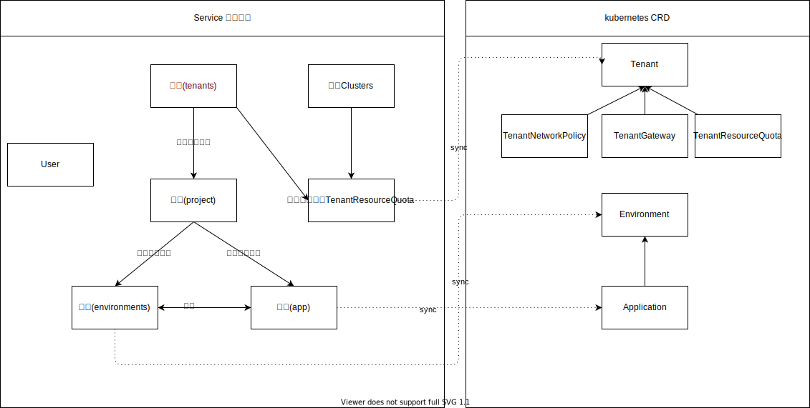

## 主要数据模型

数据模型的主要层级关系为 `租户 -> 项目 -> 环境 -> 应用`;

对应到集群中的以下资源

| 资源|简写| group/version| 是否是namespaced资源| Crd|
| ---|---|---|---|---|
|environments                      |tenv               |gems.kubegems.io/v1beta1            |false        |Environment|
|tenantgateways                    |tgw                |gems.kubegems.io/v1beta1            |false        |TenantGateway |
|tenantnetworkpolicies             |tnetpol            |gems.kubegems.io/v1beta1            |false        |TenantNetworkPolicy |
|tenantresourcequotas              |tquota             |gems.kubegems.io/v1beta1            |false        |TenantResourceQuota |
|tenants                           |ten                |gems.kubegems.io/v1beta1            |false        |Tenant |

1. 系统内顶级资源为 `租户` 和 `集群`,  租户和集群都由系统管理员添加；租户与集群通过`TenantResourceQuota`关联，一个租户在一个集群下只能存在一个TenantResourceQuota;
租户映射到集群中的CRD为`Tenant`, 租户CRD下存在`网络隔离策略(TenantNetworkPolicy)`和`资源限制(TenantResourceQuota)`以及`租户网关(TenantGateway)`, 这些子资源都将在租户crd创建的时候默认创建；

2. `用户(Users)`与租户，项目，环境都存在着关联关系，这些关联关系将为以后的用户权限提供数据支持；

3. `项目`仅仅是平台侧的概念，它表示一组应用的集合

4. `环境`与集群的`namespace`关联，实现环境隔离，资源限制，网络隔离等，环境则更多的是运维相关属性;

5. `应用`表示真实的应用

## 用户认证 和 登陆

1. 本地认证，支持账号+密码登陆

2. 外部认证，支持ldap和oauth2的认证

## 用户权限

系统的用户权限主要通过`角色`实现, `角色`又分为`系统级角色`,`租户级角色`,`项目级角色`和`环境级角色`;

1. 系统级角色

- 系统管理员
	
	`系统管理员`的职责是管理系统资源，集群，集群插件，租户等; 系统管理员拥有一切资源的操作权限和读权限
	 
- 普通用户

	普通用户代表kubgems中的普通成员，用用`普通用户`角色的账号仅能登陆系统，其他租户，项目等权限将根据租户和项目下的角色判断

2. 租户级角色

- 租户管理员

	`租户管理员`的职责是负责租户的成员管理和项目管理,负责项目添加和删除，租户成员的添加和修改; 租户管理员拥有租户下的一切资源操作权限和读权限

- 租户成员

	`租户成员`默认仅可以读租户下的项目信息; 在添加`项目成员`，`环境成员`的时候，用户必须是租户成员才能作为项目成员和环境成员的备选项;
	
3. 项目级
	
- 项目管理员 

	`项目管理主`的职责是负责项目的成员管理，项目的环境管理和项目下的应用管理; 项目管理员拥有项目下的一切资源的操作权限和读权限;

- 项目成员

	项目成员拥有三个角色，分别是`开发` `测试` `运维`

	项目`开发`成员可以读所有环境，只能操作`开发`类型的环境

	项目`测试`成员可以读所有环境，只能操作`测试`类型的环境
	
	项目`运维`成员可以读所有环境，可以操作`开发` `测试` `生产`类型的环境
		
4. 环境级

- 环境reader

	默认情况下，项目成员是所有环境的reader,即只要是`项目成员`，就能读取所有的环境数据

- 环境operator

	通常不需要配置这个角色，但是有特殊的情况，例如开发需要操作`生产`环境的资源，默认情况下开发人员只能操作开发环境，这时候授权开发人员在生产环境是operator的角色，就可以操作生产环境了;