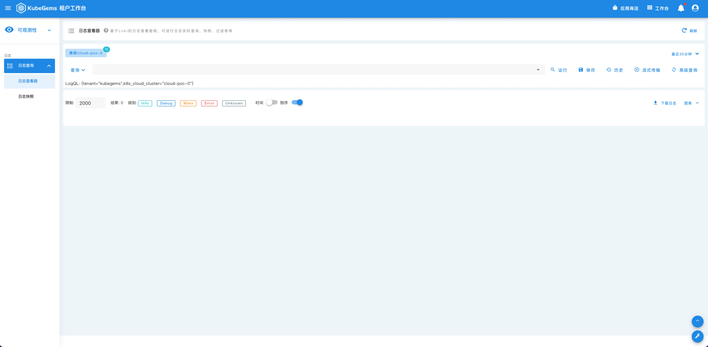
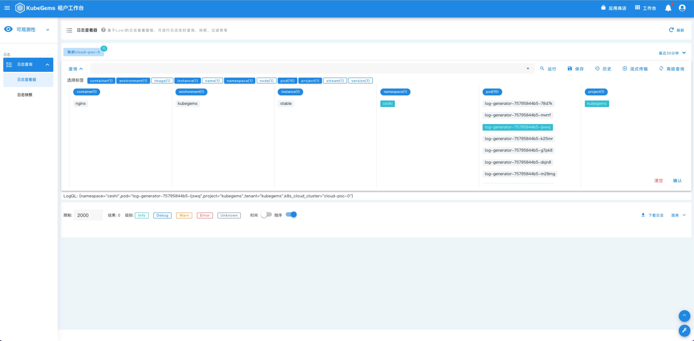
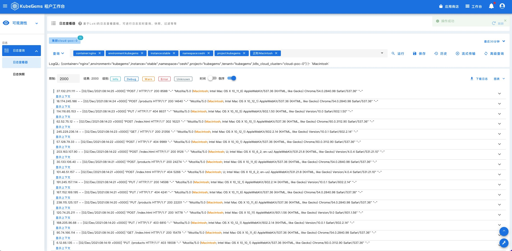
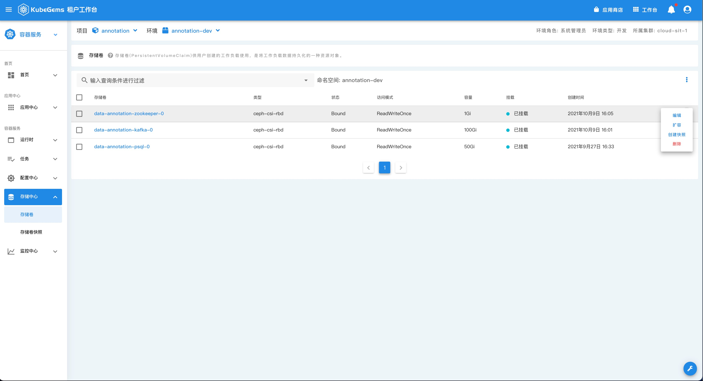
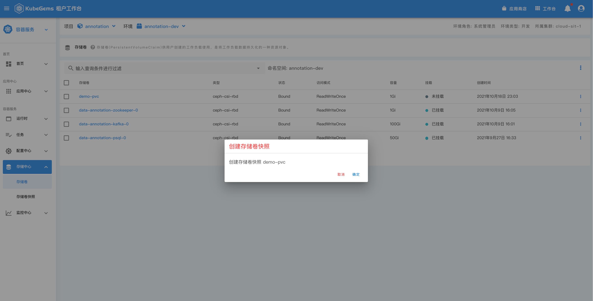
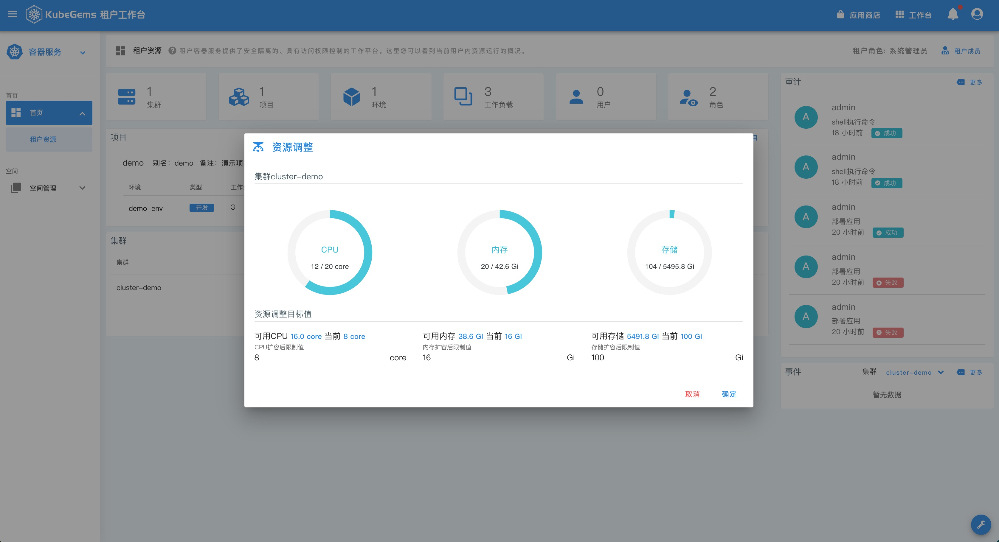
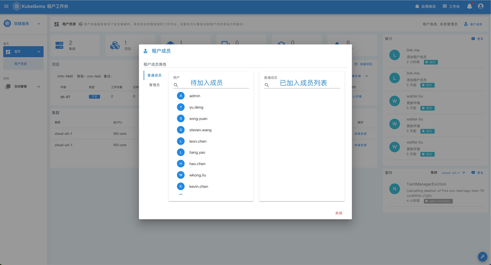
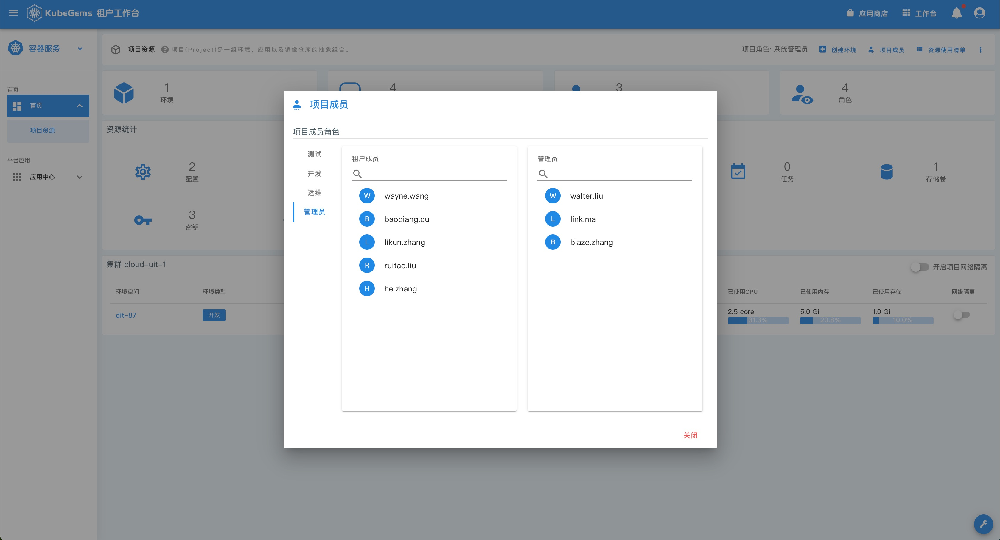
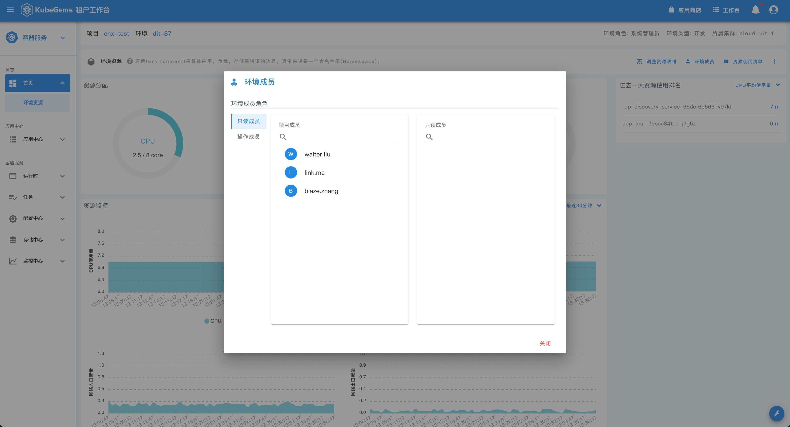

## 常见操作
---

### 概述

本文主要介绍普通用户在 KubeGems 平台的一些日常高频操作， 旨在用户能够对云平台有一个更加全面的认识。

### 工作负载

#### 查看容器日志

- 进入【容器服务】- 【运行时】-【容器组】页面，点击容器最右边的按钮展开容器组抽屉。

- 点击容器组抽屉中的 `文本` 图标弹出容器日志窗口
  

#### 访问容器控制台

- 点击容器组抽屉中的 `终端` 图标弹出容器控制台窗口
  

#### 调整副本数

- 进入【容器服务】- 【运行时】-【工作负载】页面，点击任意一个工作负载，进入详情页

- 点击工作负载详情页的右上角【调整副本数】按钮，输入需要扩（缩）的容器副本数

#### 应用回滚

- 点击工作负载详情页的右上角【回滚】按钮，选择即将回滚的历史版本
  

#### 调整动态扩缩容

- 点击工作负载详情页的右上角【弹性伸缩设置】按钮，根据表单填写扩缩容策略

<alert type="warning">注意：弹性扩缩容策略中的 `最大CPU使用率` 和 `最大内存使用率` 可以分开设置，也可以设置为同时满足。</alert>

#### 资源智能建议

- 进入【容器服务】-【工作负载】页面，当工作负载在过去一周的资源使用情况不足或繁忙时，会出现 `橙色` 的资源建议标签

- 点击 **感叹号** 图标，即可弹窗调整 **工作负载** 的资源限制到建议值

:::warning 注意
设置资源限制会触发正在运行的容器滚动更新，生产环境操作时请谨慎！
:::
#### 应用资源设置

- 进入【容器服务】-【工作负载】页面，选择要修改资源的 workerload，点击最右边按钮，选择【编辑】进入编排窗口

- 在高级配置中，选择【资源限制】进入资源分配菜单，根据用户实际情况填写

:::tip: 提示
CPU资源单位换算：1 Core = 1000m，内存资源单位换算: 1GB = 1Gi or 1024Mi 
:::

### 日志分析

####  日志查询

- 点击页面侧边栏左上角的【容器服务】，展开抽屉，选择【可观测性】，进入页面后，选择【日志查询器】

- 点击【查询】按钮，展开日志标签，根据日志标签进行过滤筛选后点击【确认】

- 如需对日志内关键字进行筛选，在标签栏中直接输入关键字即可，点击【运行】得到查询日志

####  选择时间

- 点击日志查询器右边上角的时间选择器，可以进行快速时间选择或者精细时间选择

####  查询历史

- 点击日志查询器上的【历史】按钮可弹出窗口记录了用户最近的查询语句，点击【查询】进入快速填充日志标签

### 存储操作

#### 存储卷扩容

- 进入【容器服务】-【存储中心】-【存储卷】页面，在存储卷列表的最右侧点击【扩容】 按钮。

:::tip 提示
存储卷的快照依靠外部存储设备的技术支持
:::

#### 存储卷快照

- 进入【容器服务】-【存储中心】-【存储卷】页面，在存储卷列表的最右侧点击【创建快照】 按钮。

:::warning 注意
存储卷的快照依靠外部存储设备的技术支持 
:::

### 资源配额

#### 调整环境资源配额

- 点击顶部功能栏的【工作台】，进入租户空间首页，在【项目】下找到一个环境空间，点击【进入环境】

- 点击环境空间首页右上角的【调整资源限制】按钮，进入资源配额管理

:::warning 注意
环境空间内可配置的最大资源为该租户在当前 kubernetes 集群下的最大可用资源!
:::

#### 调整默认资源限制

- 点击【修改限制】修改环境空间内的默认 `LimitRange`

:::tip
什么是[LimitRange](https://kubernetes.io/zh/docs/concepts/policy/limit-range/)?
:::

####  集群资源申请

- 点击顶部功能栏的【工作台】，进入租户空间首页，在【集群】下找到需要申请资源的集群，点击最右边的【申请资源】

:::tip 提示
租户空间内可配置的最大资源为该 kubernetes 集群下的最大可用资源!
:::

### 成员权限管理

####  租户空间成员

::tip 提示
租户管理员具备租户空间下的成员管理
:::

- 点击顶部功能栏的【工作台】，进入租户空间首页，点击页面右上角的【租户成员】进行成员管理

#### 项目空间成员

- 点击顶部功能栏的【工作台】，进入租户空间首页，在【项目】区域选择【进入项目】

- 点击项目首页右上角的【项目成员】按钮进行成员管理

:::tip 提示
项目用户成员列表继承至租户用户列表
:::

角色信息说明:

**只读权限**: 测试、开发

**读写权限**：运维、管理员
#### 环境空间成员

- 点击顶部功能栏的【工作台】，进入租户空间首页，在【项目】区域选择一个环境空间，点击【进入环境】

- 点击环境首页右上角的【环境成员】按钮进行成员管理
- 

:::tip 提示
环境用户 `成员` 和 `角色` 继承至项目用户
:::
