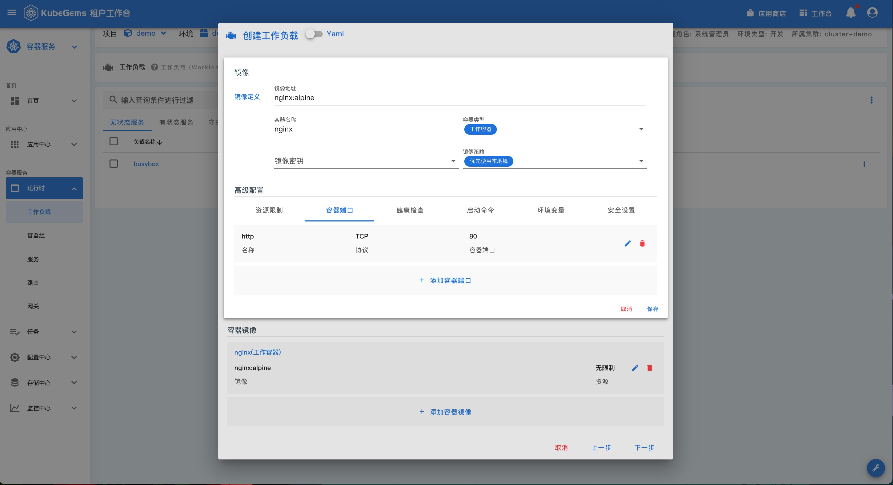
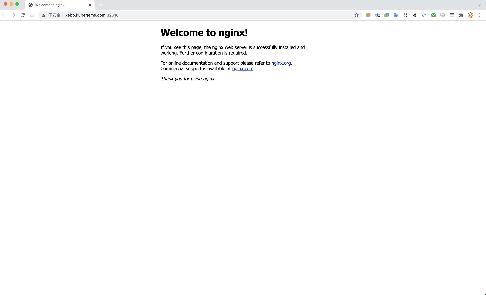

## 创建Nginx服务

---

### 概述

本文主要指导用户在 KubeGems 平台内创建一个 Nginx 服务，用于让您能够更直观的掌握平台的核心功能。

### 操作步骤

操作之前，请确保您已加入某个租户，并且该租户拥有足够的集群资源，以及操作账号具备 `运维` 或者 `管理员` 的权限。

#### 创建工作负载

1. 进入租户的环境空间，选择【容器服务】- 【工作负载】，创建一个名为 **nginx** 的无状态服务

创建Nginx的主要参数为：

- 工作负载名称：输入 Nginx 工作负载的名称
- 副本数： Nginx 服务后台运行的副本数量
- 镜像地址： Nginx 镜像的下载地址，如果是私有镜像仓库，则需要关联 `镜像秘钥`
- 容器名称： Container 的名称
- 容器端口：设置 Nginx 容器内的端口声明

1. 您还可以在编排内切换成 `yaml` 格式，将 Kubernetes 原生的 **Deployment** 资源直接粘贴至文本框。

#### 创建服务

1. 进入租户的环境空间，选择【容器服务】- 【工作负载】，创建一个名为 **nginx** 的无状态服务

创建Nginx服务的主要参数为：

- 服务名称： 输入 `Service` 资源的名称
- 关联工作负载： 选择 **Nginx** 服务与之关联的工作负载，这里为上文创建的 **Nginx**
- 访问类型：选择服务类型，分别支持 `ClusterIP` 和 `HeadLess`

:::info 信息
点击链接查看关于 [ClusterIP](https://kubernetes.io/docs/concepts/services-networking/service/#virtual-ips-and-service-proxies) 和 [Headless](https://kubernetes.io/docs/concepts/services-networking/service/#virtual-ips-and-service-proxies) 这两种服务类型的区别。
:::

#### 创建租户网关（可选）

租户网关为 KubeGems 平台为用户提供的租户级的网关隔离，用户的应用在对外暴露服务时，可以选择集群默认的网关或者租户自有的网关。

1. 进入租户的环境空间，选择【容器服务】- 【网关】，创建一个名为 **demo-gateway** 的网关

创建网关的主要参数为：

- 网关名称：输入网关的名字，网关名称会在创建 `ingress` 时通过 `ingress-class` 进行绑定
- 网关类型：访问网关的类型，默认为 `Nodeport` 即使用主机端口访问访问。`Loadbalancer` 类型为对接公有云时可指定相关 `annotation` 进行网关的创建
- 协议： 选择网关支持的协议类型，支持 `http1/1` 和 `http/2` 两种类型
- 副本数：选择运行网关服务的容器数量
- 默认域名：网关的缺省的域名，一般为对 `*.kubegems.com` 这样的二级域名进行管理

2. 网关创建成功后，可以在卡片中观察到网关的状态

3. 进入 **demo-gateway** 网关，可以查看网关的地址

更多设置请参考 [服务网关](/docs/tasks/user-operation/gateways/gateway)

#### 创建 Ingress

1. 进入租户的环境空间，选择【容器服务】- 【路由】，创建一个名为 **nginx** 的路由规则

创建路由的主要参数为：
- 路由名称：输入 `ingress` 资源的名称
- 声明网关： 选择该路由规则生效的网关，与上文中的租户网关相关联
- 路由规则
  - 域名：设置访问该服务 Web 的 `host` 名称，可以点击 【随机域名】 由平台动态生成一个 `host` 名称
  - 协议：web 的协议类型，支持 `http`、`https`、`ws`、`wss`和`grpc `
  - 路径：输入服务的 `location` 路由信息
  - 服务：选择上游服务
  - 端口：选择上游服务的端口

更多设置请参考 [服务路由](/docs/tasks/user-operation/gateways/ingress)

2. 进入 **nginx** 路由详情页，点击【路由规则】下的访问即可访问服务

