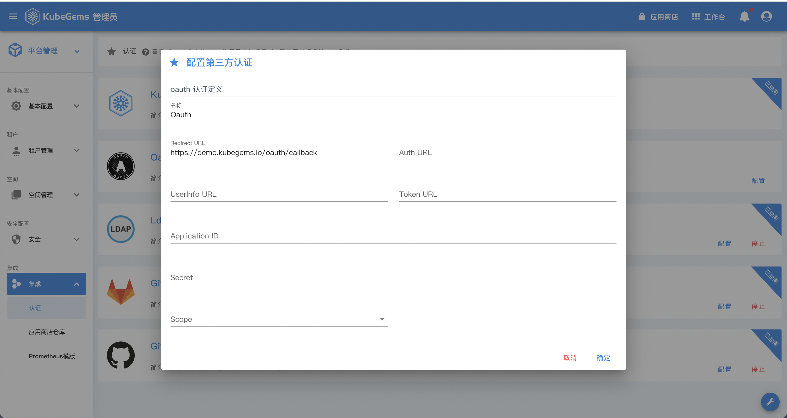

## 用户管理

---

:::important
kubegems 当前策略是以用户名作为用户的唯一标识符,用户第三方登录配置登陆后，针对平台内的用户为**不存在就创建**的策略; 所以当你在配置登陆源的时候，需要确保该登陆源(ldap或oauth)是可信，安全的;
:::

### 系统用户管理

系统用户分为 **系统管理员** 和 **普通用户**两个角色，系统用户管理的工作是由**系统管理员**负责，目前提供的操作有 `重设密码`、`删除用户`和`修改系统角色`

入口 `平台管理 -> 租户管理 -> 用户`

#### 配置用户登陆源

kubegems 提供了ldap和oauth两大类的用户接入方式，由系统管理员负责配置；

+ ldap

字段说明

|字段|说明|备注|
| ---| ---| ---|
|ldap地址|ldap host| 必填项, 格式满足 ip:port 或者 ldap://host:port ldapi://host:port/xx |
|basedn|ldap basedn| 必填项，用户的basedn |
|username|ldap bind user| 必填项，binduser,需要填写完整dn |
|password|ldap bind password| 必填项，bind password |
|开启tls|是否使用tls| 默认系统会忽略证书验证 |

+ oauth2

字段说明

|字段|说明|备注|
| ---| ---| ---|
|redirectURL|oauth2 重定向到本地服务的地址|这个字段通常由系统自动生成，需要在oauth provider中填写，且必须一致|
|authURL|oauth2 的用户登陆地址| 必填项，系统内置的gitlab和github，不需要填写 |
|tokenURL|oauth2 获取access_token的地址| 必填项, 系统内置的gitlab和github，不需要填写  |
|userInfoURL|获取用户信息的地址| 必填项，response中必须有username或者name，不然登陆失败 |
|applicationID|oauth2 provider application id| 必填项 |
|secret|oauth2 provider application secret| 必填项 |
|scope|oauth2 获取数据的scope | 如果权限不足，可能读取不到对应的数据 |

### 租户成员管理

租户成员分为 **租户管理员** 和 **租户普通成员**; 租户成员管理位于**工作台**,由租户管理员负责分配租户成员角色，租户角色的定义可以查看这篇文档[权限设计](/blog/kubegems-perms) 
### 项目成员管理

项目成员分为 **项目管理员**、**开发**、**测试**和**运维**; 项目成员位于项目空间详情页(工作台 -> 空间管理 -> 项目 -> 选择具体项目), 项目角色定义查看这篇文档[权限设计](/blog/kubegems-perms) 
### 环境成员管理

环境成员分为 **只读成员**和**可操作成员**; 环境成员位于环境详情页面(工作台 -> 选择具体环境), 项目角色定义查看这篇文档[权限设计](/blog/kubegems-perms) 
