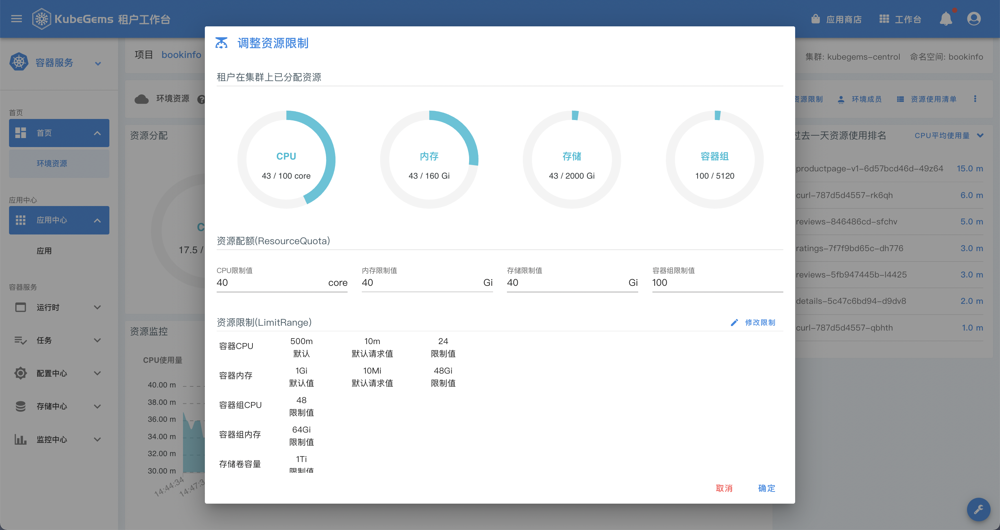

## 环境资源

kubegems 默认对单个环境存在资源限制，如果单个环境下的使用资源超过了限制，那么新的容器将不能被部署，如果是采用`滚动更新`策略的`Deployment`也不能更新；

用户可以在`环境资源`页面看到环境下的资源实时和历史的使用情况,同时环境资源页也提供了当前环境在过去一天各个pod对于各种资源的使用量统计信息;

如果环境资源不足，那么`项目管理员`、`租户管理员`或者`系统管理员`都可以对环境进行资源调整；资源调整上方会显示当前租户在这个集群下的资源使用情况，如果租户在这个集群下的资源不足，那么将不能申请更多资源;

资源配额

|字段|说明|备注|
|---|---|---|
|cpu限制值|所有pod的limits.cpu之和不能超过这个值||
|内存限制值|所有pod的limits.memory之和不能超过这个值||
|存储限制值|所有pvc的size之和 不能超过这个值||
|容器组限制值|容器数量之和不能超过这个值||

资源限制

|字段|说明|备注|
|---|---|---|
|容器 cpu 默认值|单容器的limits.cpu的默认值，如果workload没有提供，将用这个值填充||
|容器 cpu 默认请求值|单容器的requests.cpu的默认值，如果workload没有提供，将用这个值填充||
|容器 cpu 限制值|单容器的limits.cpu的最大值，如果workload中的这个值超过了它，将无法下发||
|容器 memory 默认值|单容器的limits.memory的默认值，如果workload没有提供，将用这个值填充||
|容器 memory 默认请求值|单容器的requests.memory的默认值，如果workload没有提供，将用这个值填充||
|容器 memory 限制值|单容器的limits.memory的最大值，如果workload中的这个值超过了它，将无法下发||
|容器组CPU|单个pod的cpu限制，即pod内的cpu之和不能大于这个值||
|容器组内存|单个pod的memory限制，即pod内的memory之和不能大于这个值||
|存储卷容量|单个存储卷的最大容量,超过这个值将不可以被创建出来||